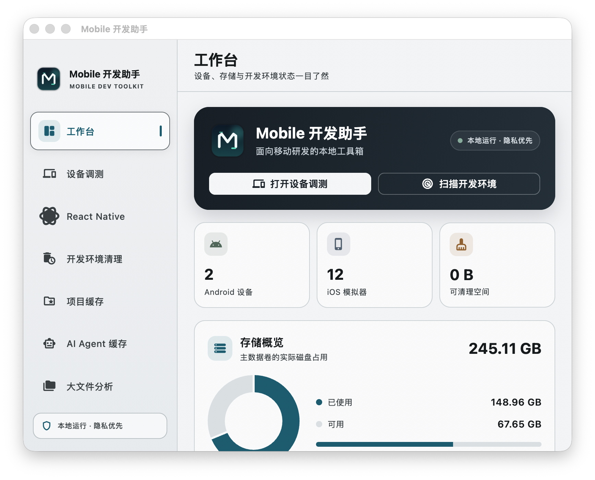
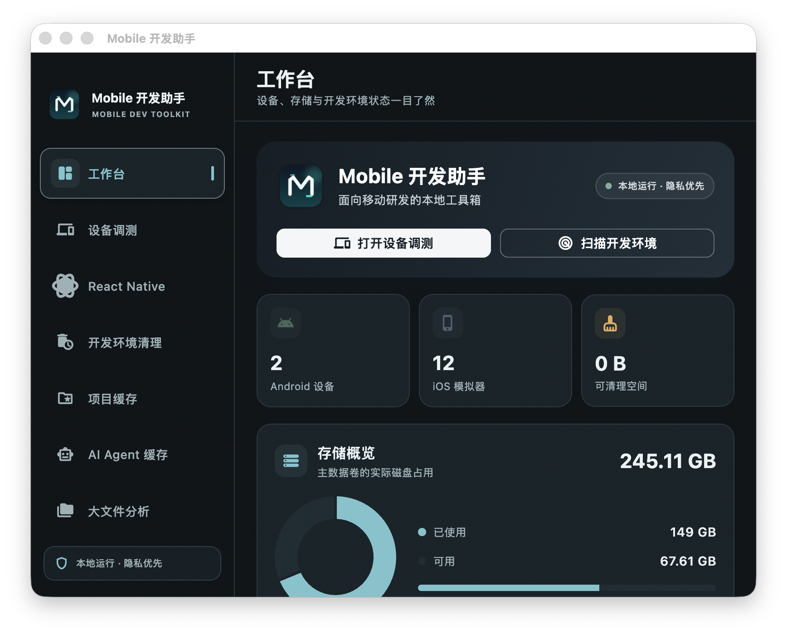

# Mobile 开发助手

面向移动研发团队的本地优先 macOS 工作台，把 Android、iOS、React Native 调测和开发环境清理放进一个安静、可控的工具里。

[产品介绍网站](docs/index.html) · [下载 DMG](build/Mobile-Dev-Assistant.dmg) · [GitHub](https://github.com/techskillplanet/cleanourmac)



## 核心能力

### Android 与 iOS 设备调测

- Android 真机、AVD 发现、启动、停止和删除
- ADB Shell、Logcat、APK 安装、截图
- 返回、主页、最近任务、开发菜单和 JS 重载
- 电脑剪贴板与 Android 双向复制，支持中文和特殊字符
- Android 模拟器配置体检：AVD 描述、系统镜像、电脑键盘和离线锁文件
- 配置修复前自动备份，不删除应用数据、快照和用户文件
- iOS Simulator 启动、停止、打开、抹除和删除
- iOS 实时日志、`.app` 安装、截图、URL 打开和 RN 调测

### React Native 工作流

- 识别本地 RN 项目和 Metro 状态
- 快捷执行 `yarn android`、`yarn ios`、`yarn charles`
- 快速打开开发菜单和重载 JS
- 支持 Cursor、Codex、WebStorm、VS Code、Android Studio 等 IDE
- 端口监听、ADB reverse 和开发服务状态检查

### 开发环境清理

- Claude Code、OpenCode、Trae、Qoder、Codex、Cursor 缓存检测
- Flutter、Android、iOS、React Native、Web 项目缓存检索
- Dart Pub、Gradle、CocoaPods、SwiftPM、npm、Yarn、pnpm、Bun
- Playwright、Cypress、Deno、Corepack 等工具缓存
- Node Modules、大文件和磁盘空间分析
- 只选择可重建资源，清理前明确确认
- `0 KB` 项目从结果列表中自动过滤

### 本地优先

- 默认中文，支持英文
- 不上传项目源码、日志和剪贴板内容
- 不默认删除任何文件
- 删除和配置修复均提供确认、范围说明和备份
- 深色模式使用独立的暗色语义色



## 安装

下载 Release 中的 `Mobile-Dev-Assistant.dmg`，将应用拖入 `Applications`。

当前 DMG 使用 ad-hoc 签名，没有 Apple Developer 发布证书。首次打开如果被 Gatekeeper 拦截，请右键应用选择“打开”，或执行：

```bash
xattr -dr com.apple.quarantine "/Applications/Mobile 开发助手.app"
```

如果需要扫描完整开发目录、Android SDK、模拟器数据或系统日志，请在“系统设置 → 隐私与安全性 → 完全磁盘访问权限”中授权。

## 从源码运行

要求：macOS、Flutter stable、Xcode command line tools；使用 Android 功能时需要 Android SDK。

```bash
flutter pub get
flutter run -d macos
```

构建 DMG：

```bash
bash scripts/build_dmg.sh
hdiutil verify build/Mobile-Dev-Assistant.dmg
```

## 验证

```bash
flutter analyze
flutter test
```

## 项目结构

```text
lib/core/        主题、颜色、格式化和通用组件
lib/data/        Shell、ADB、simctl、扫描器和仓储
lib/domain/      设备、缓存、扫描和配置模型
lib/features/    工作台、设备调测、RN、清理和设置页面
lib/l10n/        中英文 ARB 与生成文件
lib/providers/   Riverpod 状态与依赖注入
docs/            产品介绍网站、截图和发布素材
```

## 发布

项目使用 Git tag 和 GitHub Release 发布 macOS DMG。发布前建议完成：

```bash
flutter analyze
flutter test
bash scripts/build_dmg.sh
hdiutil verify build/Mobile-Dev-Assistant.dmg
```
